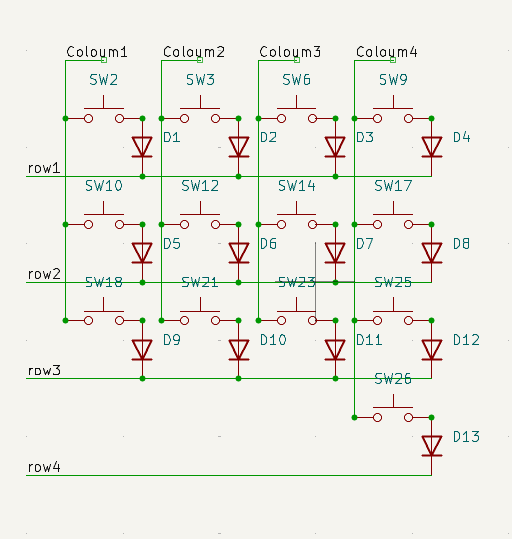

# September 29: Started the designing the schematic for the keyboard

I have selected the Seeed XIAO nRF52840 to be used as the microcontroller this is because of its wireless connectivity and integrated battery management which will simplify the design of the PCB which is useful as I am a novice at pcb design.
I created the matrix for the  for the keyboard this is because own the microcontrollers not having enough pins for each key to get it's own this took me a while because of the initial setup (getting libraries etc) and because of my lack of familiarity with Kicad and pcb design.

